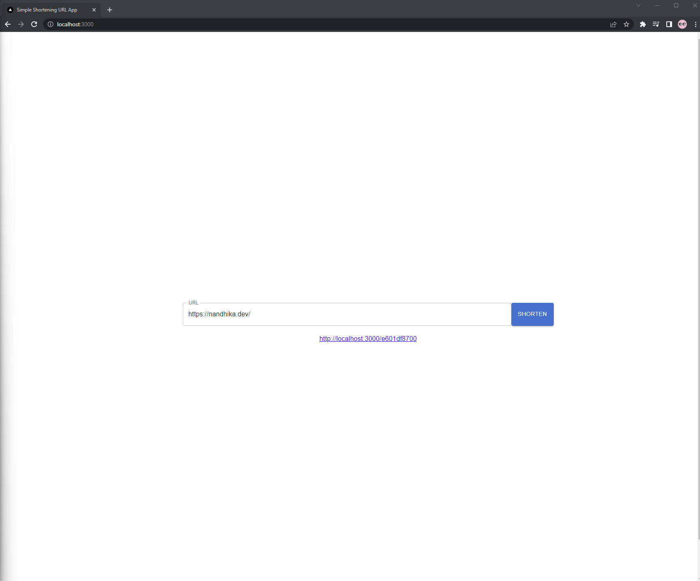
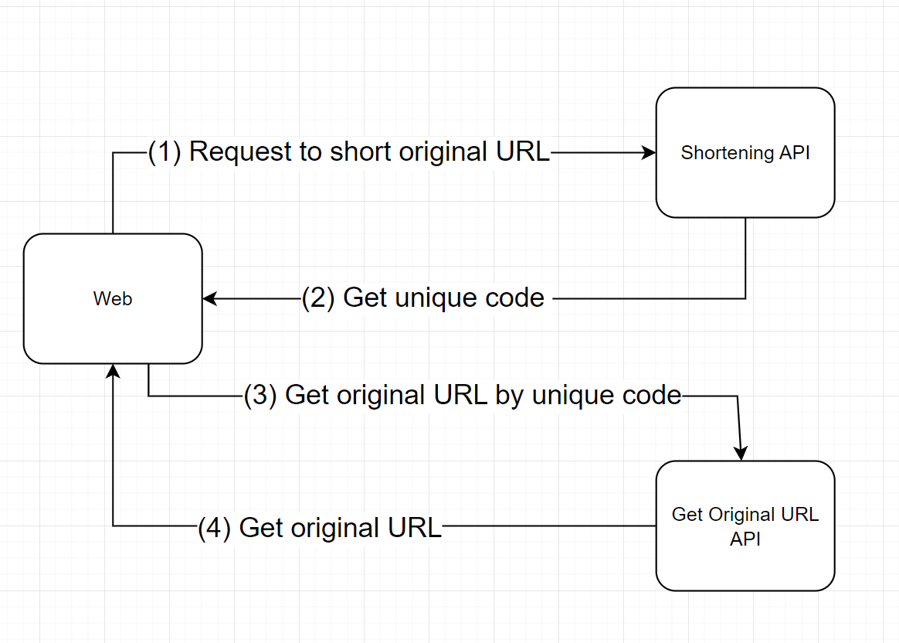

# URL Shorterner App

This web application is designed to shorten long URLs into shorter one.

## Documentations

- [API Documentation](./api/README.md)
- [Web Documentation](./web/README.md)

## Main Flow



## Run Entire Systems via Docker
1. Ensure you have installed Docker in order to run this command. Also ensure port 3000 and 8000 are not occupied so the app can utilize the port in order to run.
    ```
    docker-compose up --build
    ```

2. Done, now you can access development app on [http://localhost:3000](http://localhost:3000)

### Tested Environment
- Windows 11 Home (22621.1555)
- Docker version 23.0.5, build bc4487a
- Docker Compose version v2.17.3